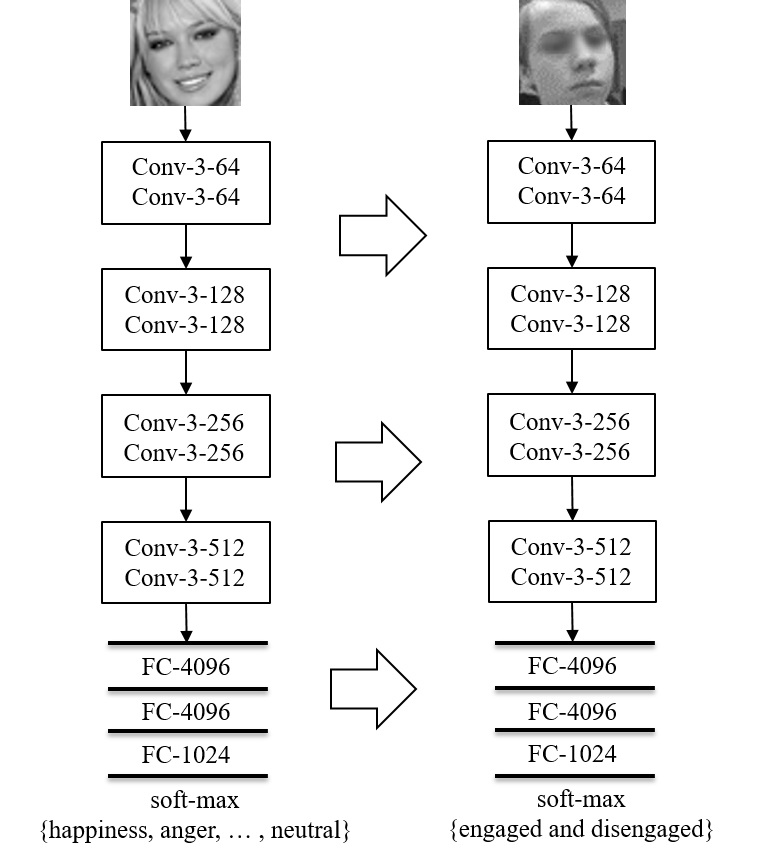

# Engagement Recognition

TensorFlow implementation of [Automatic Recognition of Student Engagement using Deep Learning and Facial Expression](https://arxiv.org/abs/1808.02324) proposing a deep learning model to recognize engagement from images.


### Engagement Model
This work presents a deep learning model to improve engagement recognition from images that overcomes the data sparsity challenge by pre-training on readily available basic facial expression data, before training on specialised engagement data. In the first of two steps, a facial expression recognition model is trained to provide a rich face representation using deep learning. In the second step, we use the model's weights to initialize our deep learning model to recognize engagement; we term this the Engagament model.

<p align="center">

</p>

### Reference
if you use our code or model, please cite our paper:
```
@article{nezami2018deep,
  title={Automatic Recognition of Student Engagement using Deep Learning and Facial Expression},
  author={Mohamad Nezami, Omid and Dras, Mark and Hamey, Len and Richards, Deborah and Wan, Stephen and Paris, Cecile},
  journal={arXiv preprint arXiv:1808.02324},
  year={2018}
}
```
### Data
We train the model on our new engagement recognition (ER) dataset with 4627 engaged and disengaged samples. We split the ER dataset into training (3224), validation (715), and testing (688) sets, which are subject-independent (the samples in these three sets are from different subjects).

### Requiremens
1. Python 2.7.12
2. Numpy 1.15.2
3. Tensorflow 1.8.0

### Content
1. [CNN Model Source Code](/code/CNN_model.py)
2. [VGG Model Source Code](/code/VGG_model.py)
3. [Engagement Model Source Code](/code/VGG_model.py)

### Train
1. Add your pretrained models on the FER-2013 dataset
2. Run the model's script:
````
    python VGG_model.py train
````

### Test
1. Add your trained models on the ER dataset
2. Run the model's script:
````
    python VGG_model.py test
````
    
### Results
|                   | Accuracy     | F1 | AUC    |
|-------------------|:-------------------:|:------------------------:|:---------------------:|
|Engagement Model | 72.38%  | 73.90% | 73.74%  |

The [CNN Model](/code/CNN_model.py) is inspired from [Emotion recognition with CNN](
https://github.com/isseu/emotion-recognition-neural-networks).
